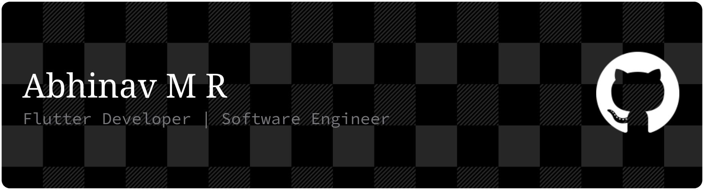

<div align="center">



[](https://git.io/typing-svg)

</div>

---

## 👨‍💻 About Me

```yaml
name: Abhinav M R
education: Graduate Engineer in IT from Cochin University Of Science And Technology, Kerala
location: Kerala, India 🇮🇳️
focus: Flutter · Backend
hobbies: chess, drawing, reading
```

---

## 🛠️ Skills & Technologies

<div align="left">

**Mobile**


**Backend**


## 📫 How To Reach Me

<div align="center">

[](https://www.linkedin.com/in/abhinav-mr)
[](mailto:me.abhinavmr@gmail.com)

</div>
